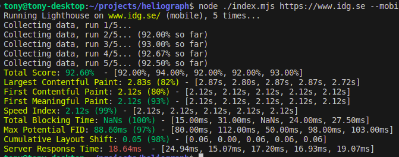

# Heliograph

A Node script that runs [Lighthouse CLI](https://github.com/GoogleChrome/lighthouse) x number of times and gives you the average of values like:

- Total score
- Largest Contentful Paint
- First Contentful Paint
- Time to Interactive
- Total Blocking Time
- Cumulative Layout Shift
- Speed Index

It shows both the numeric value, and the score in percentage.

It also saves the reports in HTML and JSON to disk, in a nice folder structure so that you can go back in history and compare details. It also saves the summary that is displayed in the terminal.

Reports will be saved to folder in a structure like `domain > path > date > date.report.html/json`. Don't forget to change the outputPath in index.mjs.

## Installation

No need, it will use NPX and the Lighthouse CLI package. You need NodeJS though.

## Usage

```bash
node ./index.mjs https://www.yoursite.com
```

## Options

- `--sync` runs one test at a time, takes more time, at the same time it can be more accurate
- `--runs` number of runs, default is 5
- `--mobile` for mobile emulation
- `--block-gtm` to block Google Tag Manager

## Configuration

Change the outputPath and runs in index.mjs to your liking.

## Screenshots


